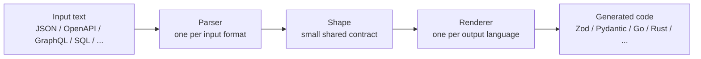

# Schemato

> Browser-only schema converter for JSON, JSON Schema, OpenAPI, GraphQL, SQL DDL, Protobuf, Prisma, Mongoose, Avro, and TypeScript.

[](https://opensource.org/licenses/MIT)
[](https://nextjs.org/)
[](https://nextjs.org/docs/app/building-your-application/deploying/static-exports)

**Live**: <https://www.schemato.top>

Schemato turns **10 input formats** into typed code for **15 target languages**. It is built for developers who need a quick type, validator, or DTO from a sample payload or schema without installing a CLI or uploading data to an API.

- **149 live converter pages** generated from one format registry
- **Multi-sample JSON inference**: paste NDJSON samples to capture optional fields
- **100% client-side conversion**: pasted payloads stay in the browser
- **No signup, no backend, no API cost**
- **Open source** under the MIT license

---

## Quick examples

| Need | Try |
|---|---|
| Runtime validation for a JSON API response | [JSON -> Zod](https://www.schemato.top/json-to-zod) |
| FastAPI models from a JSON Schema | [JSON Schema -> Pydantic](https://www.schemato.top/json-schema-to-pydantic) |
| TypeScript interfaces from GraphQL SDL | [GraphQL -> TypeScript](https://www.schemato.top/graphql-to-typescript) |
| Go DTOs from SQL DDL | [SQL DDL -> Go struct](https://www.schemato.top/sql-to-go-struct) |
| Compare with quicktype | [Schemato vs quicktype](https://www.schemato.top/compare/quicktype) |

---

## Supported formats

### Inputs

| Input format | Status | Notes |
|---|---:|---|
| JSON | Live | Infers a shared `Shape` from one sample, arrays, or NDJSON samples |
| JSON Schema | Live | Supports common object, array, enum, and primitive schema shapes |
| OpenAPI 3.x | Live | Reads schema objects from JSON or YAML-like specs |
| GraphQL SDL | Live | Parses object types into typed output models |
| SQL DDL | Live | Covers a practical Postgres / MySQL / SQLite subset |
| Protobuf | Live | Parses message fields |
| Prisma schema | Live | Parses model blocks |
| Mongoose schema | Live | Parses `new Schema({...})`-style definitions |
| Avro | Live | Parses records, enums, arrays, maps, and unions |
| TypeScript interfaces | Live | Converts TypeScript shapes into other targets |

### Outputs

TypeScript, Zod, Pydantic, Go struct, Rust struct, Swift, Kotlin, Java, C#, Dart, PHP, Ruby, Yup, Joi, and Python dataclass.

---

## Why?

I work across TypeScript, Go, and Python and got tired of:

- Writing types by hand for every new API response
- Tools that only support one or two output languages
- Tools that require installing something or paying a subscription
- Existing options that don't cover Zod, Pydantic, or modern serde-friendly Rust

Schemato fills the gap. One page per conversion, 149 statically generated converter pages, zero backend.

---

## What makes it different?

- **One converter matrix, not one-off tools**: the parser -> `Shape` -> renderer architecture keeps the project extensible.
- **Practical defaults**: optional fields from multi-sample JSON, json tags for Go, serde derives for Rust, Codable for Swift, validation-first output for Zod and Pydantic.
- **Static and cheap to host**: every converter page is generated at build time with `output: "export"`.
- **Privacy-friendly by design**: conversion logic runs in the browser; there is no conversion API receiving pasted schemas.
- **Easy to extend**: one new parser unlocks all output languages; one new renderer unlocks all input formats.

---

## Tech stack

```
Next.js 16 (App Router) + TypeScript + TailwindCSS
output: "export" → fully static, deploys anywhere
Custom JSON-shape inferrer (~150 LOC, no quicktype dependency)
Input parsers → shared Shape model → per-language renderers
```

---

## Architecture

Instead of writing one adapter per conversion pair, Schemato uses a small intermediate `Shape` model:



That keeps the project linear:

- New input format: write one parser, get every output language.
- New output language: write one renderer, get every input format.
- New converter page: generated automatically from the format registry.

---

## Project layout

```
app/
  layout.tsx              # global header/footer
  page.tsx                # homepage with the matrix
  [slug]/page.tsx         # dynamic route /<from-slug>-to-<to-slug>
  sitemap.ts              # sitemap.xml generator
  robots.ts
components/
  ConverterShell.tsx      # left input / right output UI (client)
lib/
  formats.ts              # 24 format registry (slug, sample, blurb)
  url.ts
  site.ts
  seo-copy.ts             # per-pair SEO copy generator
  converters/
    index.ts              # registry + bridge (parser → renderer)
    json-shape.ts         # internal Shape type + JSON inferrer
    *-shape.ts            # input parsers → Shape
    renderers.ts          # all 15 language renderers (Shape → code)
    json-to-*.ts          # custom JSON adapters (one per language)
```

---

## Run locally

```bash
npm install
npm run dev          # http://localhost:3000
npm run build        # generates the static export in out/
```

## Privacy

Conversions run in the browser. Schemato does not upload pasted schemas or payloads to a conversion API.

The site uses aggregate analytics to understand product usage, but conversion input and generated output are not sent as analytics event data.

---

## For directory and awesome-list maintainers

- Category: developer tool, schema converter, code generator, typed API tooling
- License: MIT
- Pricing: free
- Source: open source on GitHub
- Account required: no
- Hosted demo: <https://www.schemato.top>
- Primary use cases: JSON -> Zod, JSON Schema -> Pydantic, OpenAPI -> TypeScript, SQL DDL -> Go struct, multi-format schema conversion
- Privacy posture: browser-only conversion; pasted schemas are not sent to a conversion API

---

## Useful links

- Live site: <https://www.schemato.top>
- Changelog: <https://www.schemato.top/changelog>
- Guides: <https://www.schemato.top/guides>
- Privacy: <https://www.schemato.top/privacy>
- Security: <https://github.com/weitaishan/schemato/blob/main/SECURITY.md>
- Issues: <https://github.com/weitaishan/schemato/issues>

---

## How to add a new input format

1. Create `lib/converters/<name>-shape.ts` exporting:

   ```ts
   export function nameToShape(input: string, rootName?: string):
     | { ok: true; shape: Shape }
     | { ok: false; error: string }
   ```

2. In `lib/converters/index.ts`:

   ```ts
   import { nameToShape } from "./name-shape";
   for (const t of ALL_TARGETS) {
     register("name", t, bridge(nameToShape, t));
   }
   ```

3. Make sure `lib/formats.ts` has the format registered with a slug + sample.

That's it — 15 new pages light up automatically.

---

## How to add a new output language

1. Open `lib/converters/renderers.ts`
2. Add `function fooType(shape: Shape): string` and `export const renderFoo: Renderer = (root, rootName) => { ... }`
3. Register it in `RENDERERS`:

   ```ts
   export const RENDERERS = {
     ...,
     foo: renderFoo,
   };
   ```

4. Add `foo` to `OUTPUT_FORMATS` in `lib/formats.ts` with a slug + sample.

All input formats now produce the new output for free.

---

## Roadmap

- [x] JSON input → 15 outputs
- [x] NDJSON / multi-sample JSON inference for optional fields
- [x] JSON Schema input → 15 outputs
- [x] OpenAPI 3.x input → 15 outputs
- [x] GraphQL SDL input → 15 outputs
- [x] SQL DDL input → 15 outputs
- [x] Protobuf input → 15 outputs
- [x] Prisma schema input → 15 outputs
- [x] Mongoose schema input → 15 outputs
- [x] Avro input → 15 outputs
- [x] TypeScript input → 14 outputs
- [ ] Discriminated union output for `oneOf` JSON Schema
- [ ] CLI version (`npx schemato json-to-zod < schema.json`)
- [ ] VS Code extension

---

## Contributing

PRs welcome. The project is small and the architecture rewards adding one renderer / parser at a time:

- Want Elixir / Scala / Haskell as an output language? Add a renderer.
- Want another schema language as input? Add a parser.
- Found an incorrect conversion? Open a bug report with a reduced input sample.
- Want a new converter pair prioritized? Open a converter request.

Each adapter is independent; nothing else needs to change.

---

## License

MIT
